# 소규모 건설공사 설계 자동화 — 쇼룸

**[국토교통]** 읍면동 토목직이 직접 설계하는 소규모 건설공사(총공사비 3천만 원 이하)의
**야장 → 도면 → 수량산출서 → 설계내역** 과정을 자동화하는 도구입니다.
현업 지방공무원(토목직)이 AI 코딩 에이전트를 활용해 직접 개발하고 있으며, 실제 설계 건으로 검증하면서 범위를 넓히고 있습니다.

> 이 저장소는 **쇼룸**입니다. 어떻게 돌아가는지와 결과물의 모습만 보여 드립니다. 소스 코드·자료·테스트는 비공개 저장소에 있습니다.
> 아래 샘플은 모두 **가상 예제**(가상 마을·가상 단가)로 만든 결과물이며, 실제 공사명·지번·금액은 들어 있지 않습니다.

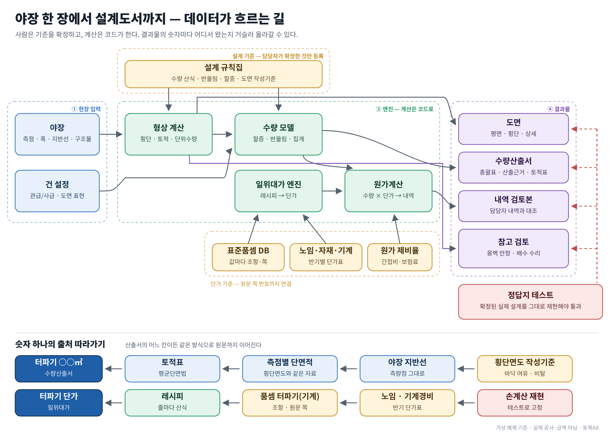

**사람은 기준을 확정하고, 계산은 코드가 한다.** 결과물의 숫자마다 어떤 규칙·입력에서 왔는지 거슬러 올라갈 수 있습니다.

## 시연 영상 (1분 38초)

<a href="video/demo.mp4">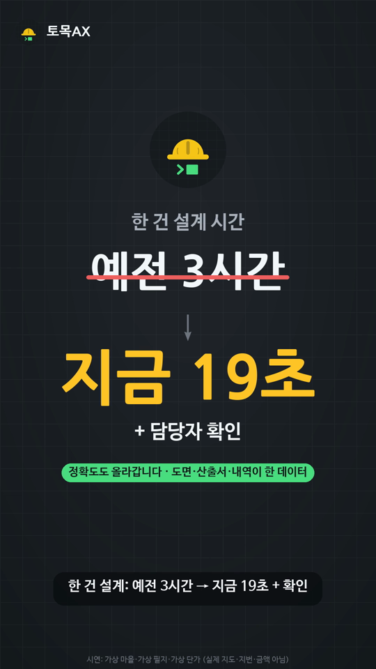</a>

야장 → 위치도·편입예상필지 조서 → 도면 → 수량산출서 → 내역서까지 한 흐름으로 보여 줍니다. **[▶ 영상 보기](video/demo.mp4)** (세로 9:16, 소리 있음)

영상 속 마을·필지·항공영상·단가는 가상이며, 금액은 보여 주지 않습니다.

## 왜 만들었나

읍면동 토목 담당자는 매년 수십 건의 소규모 공사를 자체 설계합니다. 현장 야장을 보고 도면을 그리고,
면적·자재·숭상 수량을 손으로 계산해 수량산출서를 만든 뒤 내역 프로그램에 옮겨 적는 과정이 모두 수작업이고,
읍면동마다 양식이 제각각입니다. 이 도구는 **야장만 표준 형식으로 적으면 도면·산출서가 나오도록** 해
반복 계산을 없애고, 같은 양식을 쓰게 하는 것을 목표로 합니다.

## 흐름

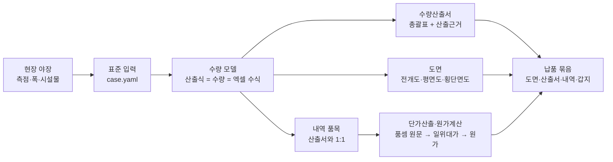

입력 한 번으로 도면·수량산출서·산출근거·납품 묶음까지 만듭니다. 계산은 결정론적 코드가 하고, AI는 규칙 정리·검토·문장 작성에만 씁니다.

## 결과물 샘플 (가상 예제)

<a href="samples/demo04_drainage/drawing_location.png">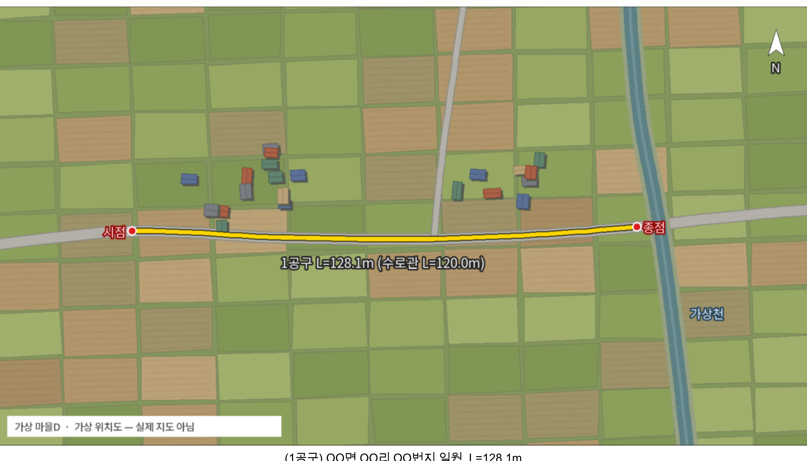</a> <a href="samples/demo04_drainage/drawing_plan.png">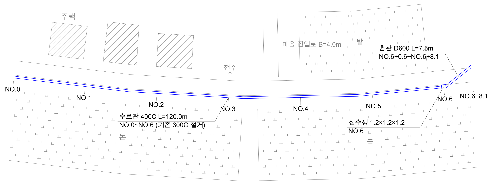</a>

왼쪽: 위치도(가상 마을 그림 — 실제 지도 아님) · 오른쪽: 배수로 계획평면도 1:400 — 설계 시설물은 검정·파랑, 주변 현황(논·밭·주택·진입로·전주)은 회색 배경. 그림을 누르면 도곽 한 장 전체

| 공종 | 대표 화면 (누르면 도곽 한 장) | 도면 · 수량산출서 | 더 보기 |
|---|---|---|---|
| **아스콘 덧씌우기** 확포장·숭상·접속 | <a href="samples/demo01_asphalt/drawing_strip.png">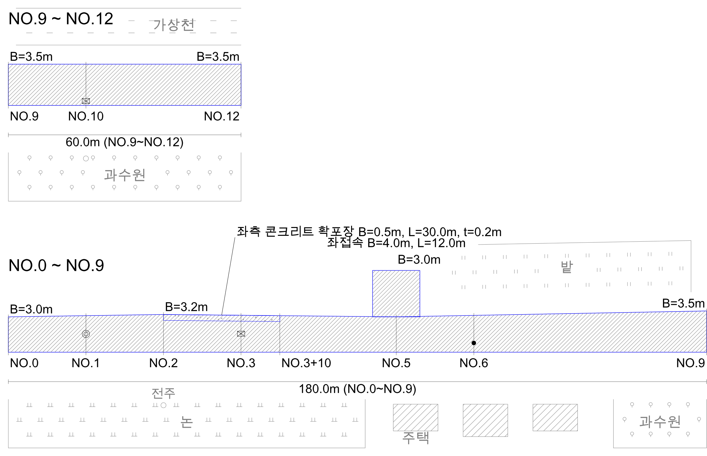</a> | demo01 [도면](samples/demo01_asphalt/drawing.pdf) · [산출서](samples/demo01_asphalt/sheet.pdf) demo02 [도면](samples/demo02_asphalt_standard/drawing.pdf) · [산출서](samples/demo02_asphalt_standard/sheet.pdf) | [위치도](samples/demo01_asphalt/drawing_location.png) · [전개도(폭 급변)](samples/demo02_asphalt_standard/drawing_strip.png) · [총괄표](samples/demo01_asphalt/sheet_summary.png) · [산출근거](samples/demo01_asphalt/sheet_basis.png) |
| **콘크리트 깨기및복구** 줄눈·컷팅·앙카 | <a href="samples/demo03_concrete/drawing_plan.png">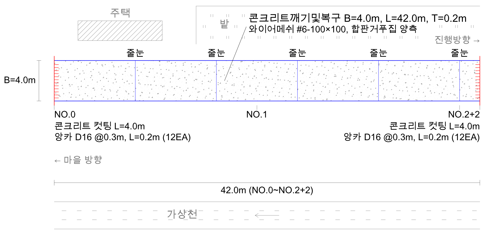</a> | [도면](samples/demo03_concrete/drawing.pdf) · [산출서](samples/demo03_concrete/sheet.pdf) | [횡단면도](samples/demo03_concrete/drawing_section.png) · [총괄표](samples/demo03_concrete/sheet_summary.png) · [산출근거](samples/demo03_concrete/sheet_basis.png) |
| **배수로** 횡단 · 토적 · 수리 | <a href="samples/demo04_drainage/drawing_section.png">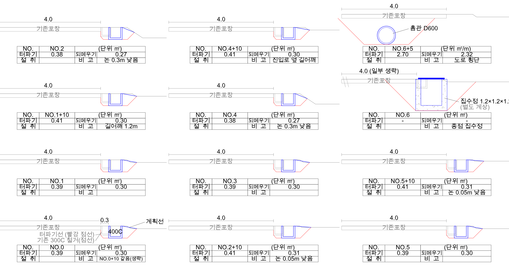</a> | [도면](samples/demo04_drainage/drawing.pdf) · [산출서](samples/demo04_drainage/sheet.pdf) | [계획평면도](samples/demo04_drainage/drawing_plan.png) · [위치도](samples/demo04_drainage/drawing_location.png) · [토적계산서](samples/demo04_drainage/sheet_earthwork.png) · [수리계산(참고)](samples/demo04_drainage/sheet_hydraulics.png) · [총괄표](samples/demo04_drainage/sheet_summary.png) |
| **식생블럭 호안** 횡단 · 안정검토 φ30에서 활동 1.31 &lt; 1.5 → 검토 시트가 담당자에게 경고(단면은 자동으로 바꾸지 않음) | <a href="samples/demo05_revetment/drawing_section.png">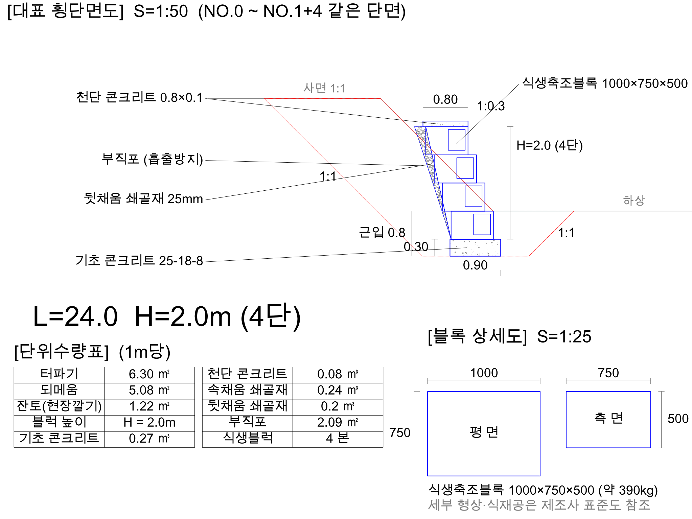</a> | [도면](samples/demo05_revetment/drawing.pdf) · [산출서](samples/demo05_revetment/sheet.pdf) | [평면도·정면도](samples/demo05_revetment/drawing_plan.png) · [안정검토(참고)](samples/demo05_revetment/sheet_stability.png) · [총괄표](samples/demo05_revetment/sheet_summary.png) · [산출근거](samples/demo05_revetment/sheet_basis.png) |

- 배수로는 측점마다 지반선·터파기선·계획선을 그린 횡단면도(1:50, 한 장 3열×4단)와 같은 자료로 평균단면법 토적계산서를 만듭니다.
- 평면도의 주변 현황(논·밭·주택·하천·진입로 등)은 선택 입력이며, 설계 글자와 겹치지 않게 회색 배경으로만 그립니다.
- 안정검토·수리계산은 **검토용 참고 — 결과로 단면·규격을 바꾸지 않습니다**(기준 미달이면 경고와 추천만, 판단은 설계자).

### 위치도 · 편입예상필지 조서 (위치도도구)

<a href="samples/location_tool/location_map.png">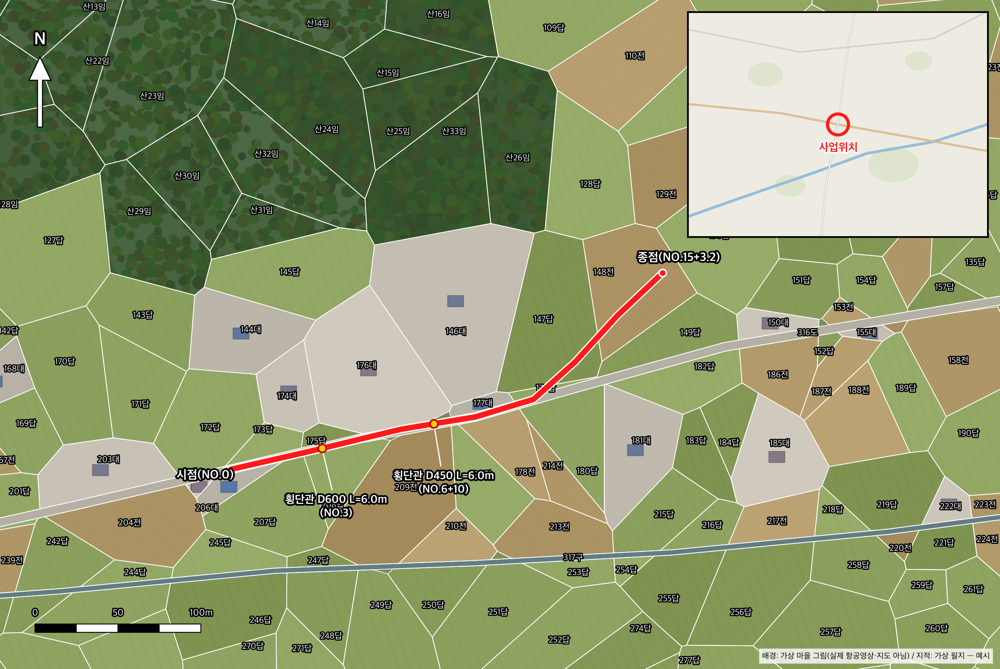</a> <a href="samples/location_tool/land_map.png">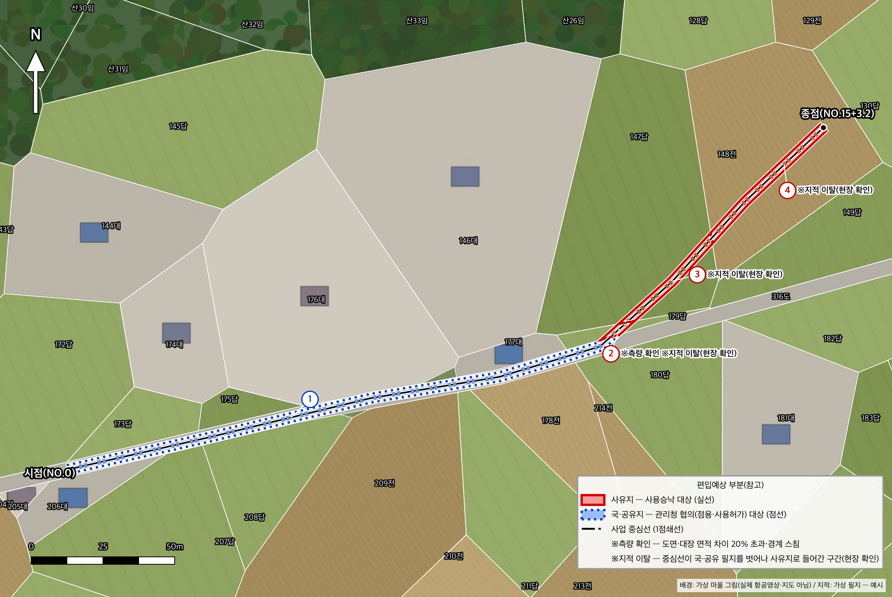</a>

왼쪽: 위치도 · 오른쪽: 편입용지도 — 샘플은 **가상 마을 그림과 가상 필지**로 만들었습니다(실제 항공영상·지도·지적·소유정보 아님). 조서: [PDF](samples/location_tool/sheet.pdf) · [그림](samples/location_tool/sheet_table.png)

- 현장에서 시점·종점·관 위치를 휴대폰으로 찍어 두면, 사진 위치정보로 지도에 점이 놓이고 항공영상 위에서 노선을 다듬습니다. GPS 측량 좌표 파일(위도·경도, 측량 원점 좌표)도 그대로 읽습니다.
- 버튼 한 번으로 위치도(도면 위치도 칸에 맞춘 그림)와 편입예상필지 조서·편입용지도를 만듭니다. 측점만 적은 시설물(횡단관 등)은 설계연장 비례로 노선 위에 놓습니다.
- 조서 비고는 규칙으로 자동: 국·공유지는 관리청 협의, 도면·대장 면적 차이가 크면 측량 확인, 노선이 공공 필지를 벗어나 사유지로 들어가면 지적 이탈(현장 확인).
- 연속지적도 기반 **참고용(법적 효력 없음)** — 면적은 '편입예상면적(참고)', 보상·분할은 지적측량 성과에 따릅니다. 토지 소유자 성명·주소는 조회하지도 저장하지도 않습니다.

**수량산출근거** — 품목마다 산출식(기호=값+단위)과 수량, 공구 → 공통 → 전체 집계(할증·올림·정수)

## 시연 영상

시연 영상은 스레드에서: https://www.threads.com/@civil__ax

## 지원 공종

| 공종·기능 | 내용 | 상태 |
|---|---|---|
| 아스콘 덧씌우기 | 본선·접속 면적, 아스콘·유제(할증, 관급 구입량 올림), 노면청소·텍코팅, 차선도색(접속부 규칙) | 실제 3건 검증 |
| 숭상(맨홀·집수정·지수전·그레이팅 인상) | 깨기·재타설 방식, 내역 품목(맨홀인상 규격)별 개소, 폐콘 참고 집계 | 실제 3건 검증 |
| 콘크리트 확포장 | 면적·레미콘·거푸집(편측/양측)·앙카(구멍뚫기·철근) | 실제 2건 검증 |
| 콘크리트 깨기및복구 | 컷팅·깨기·포장·거푸집·줄눈(최대 간격)·앙카(접속단부)·와이어메쉬·폐기물, 평면도·횡단면도 | 실제 1건 검증 |
| 배수로(수로관·흄관 교체) | 측점별 횡단면도(지반선·터파기선·계획선)·평균단면법 토적, 흄관 매설·집수정 토공, 관 본수·이음 | 실제 1건 수량 계산과 대조 |
| 식생블럭 호안 | 단면(블럭 단·기초·천단·뒷채움)·토공·호안공·부대공, 블럭 할증, 평면도·정면도·횡단면도·상세도 | 실제 1건 검증 |
| 중력식 옹벽 | 관행형 단면·토공·거푸집·배면배수, 같은 레이아웃의 도면 | 실제 1건 단면 계산과 대조 |
| 참고 검토 | 옹벽·식생블럭 간이 안정검토(활동·전도·편심), 배수 수리계산(합리식·Manning, 최소구배 구간) — 검토용 참고 | 참고 계산 재현 |
| 수량산출서 | 수량총괄표 + 수량산출근거, 내역 품목과 1:1, 산출식·수량·엑셀 수식이 같은 식 데이터, 설계변경 당초/변경 두 줄, 토적계산서·참고 시트 | 실제 5건 납품 수량과 대조 |
| 단가산출(일위대가) | 품셈 원문 대조값·노임·자재·기계 기초값 → 노무·재료·경비 원 단위, 내역서 금액 | 실제 일위대가 12개 원 단위 일치 |
| 원가계산 | 제비율·절사, 원가계산서 양식 선택, 폐기물처리비 위치, 공사비역산(이윤율·조달수수료 끝수), 수의계약 계약내역 | 실제 5건 원 단위 일치 |
| 도면 | 전개도·평면도·횡단면도(횡단형 3열×4단)·호안 평면·정면도, NOTE·범례·라벨 자리 자동, 실제 축척 표기, 설계변경 표시, 위치도(항공뷰 도로선 따라 노선), 평면도 주변 현황(회색 배경, 선택) | 실제 4건 납품 도면 대조 |
| 납품 묶음 | 도면 DXF+PDF, 위치도 그림 이름 검사, 산출서, 내역, 갑지 | 실제 납품 구성 기준 |
| 배수 구조물 | 수로관·옹벽식측구·식생블럭·옹벽 단위수량과 산출서 양식 | 1단계 완료 |

## 검증 방식

- **실제 확정 설계와 원 단위 대조**: 비공개 저장소의 테스트 **515개**가 실제 확정 5건의 수량·내역·원가를 내역 프로그램 확정본과 원 단위로, 도면·산출서를 납품본과 글자 단위로 대조합니다.
- **가상 예제 회귀**: 같은 코드를 가상 예제 5건과 가상 단가로 돌리는 테스트 **305개**. 가상 예제의 기대수량은 규칙 식으로 손계산한 값이고, 이 쇼룸의 샘플은 그 가상 예제의 결과물입니다.
- **근거 우선순위**: 표준품셈 원문(조항·쪽 번호 대조) → 발주기관 설계기준 → 과거 설계(내역 프로그램 관행). 품셈에 없는 관행값은 '근거 미확인'으로 표시해 둡니다.
- **공개 검사**: 쇼룸에 올리기 전에 금지어(실제 마을명·지번·연락처 등)와 숫자 대조(실제 정답지·실제 단가 숫자), 이용 조건, 결과물 메타데이터를 자동으로 검사합니다.

## 규칙

현장에서 확인한 설계 규칙의 목차는 [docs/규칙_목차.md](docs/규칙_목차.md)에 있습니다(상세 규칙은 비공개).

## 로드맵

| 순서 | 공종 | 상태 |
|---|---|---|
| 1 | 아스콘 덧씌우기 + 숭상 | 실제 3건으로 검증 |
| 2 | 콘크리트 확포장 | 실제 2건으로 검증 |
| 3 | 콘크리트 깨기및복구(농로 재포장) | 실제 1건으로 검증 |
| 4 | 수로관·흄관 매설(배수로 횡단형) | 구현 — 실제 1건 수량 대조, 확정 설계 등록 대기 |
| 5 | 식생블럭 호안·중력식 옹벽 | 식생블럭 실제 1건으로 검증, 옹벽 구현(확정 설계 등록 대기) |

## 참고

- 노임·제비율은 공표값, 샘플의 자재 단가·일위대가는 **가상값**입니다.
- 다른 지자체에서 사용을 원하시면 아래 이용 조건에 따라 신청해 주세요.

## 이용 조건

이 저장소는 오픈소스가 아닙니다. **열람은 공개, 사용은 허락제**입니다(전문은 [LICENSE](LICENSE)).

- 코드·문서·자료는 열람과 학습 목적의 읽기만 허용합니다. 설치·실행·복제·수정·배포·상업적 이용은 공공기관을 포함한 모든 이용자가 저작권자의 사전 서면 허락을 받아야 합니다.
- 공공기관(국가·지방자치단체·공공기관)의 비영리 업무 이용은 신청 시 무상으로 허락합니다.
- 업체의 판매·납품·용역 등 상업적 이용은 별도 협의가 필요합니다.

이용 신청·문의: https://open.kakao.com/me/tomokax — 신청하실 때 **기관명·담당 부서·이용 목적**을 알려 주세요.
