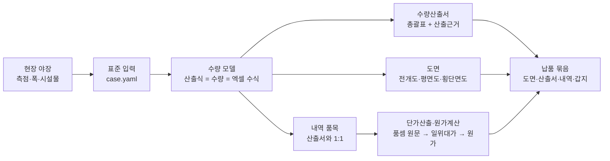
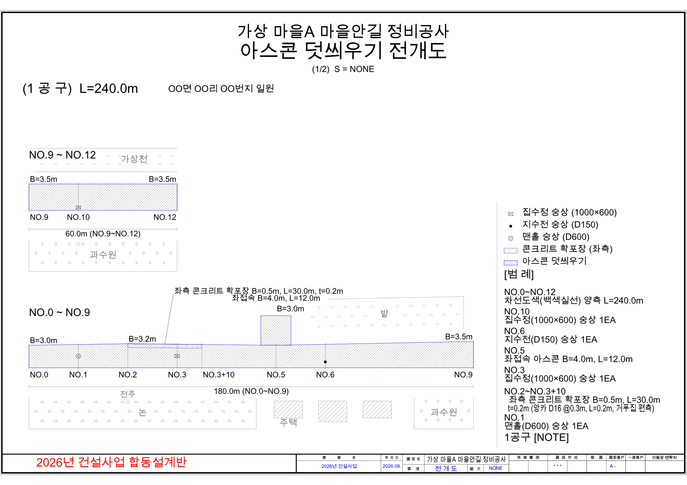
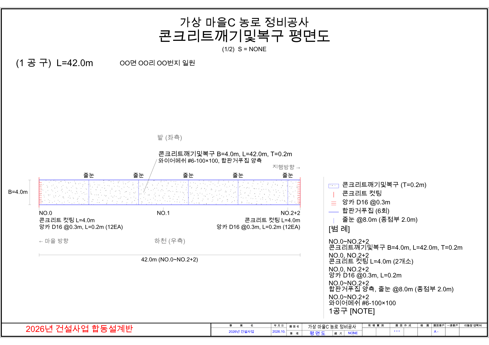
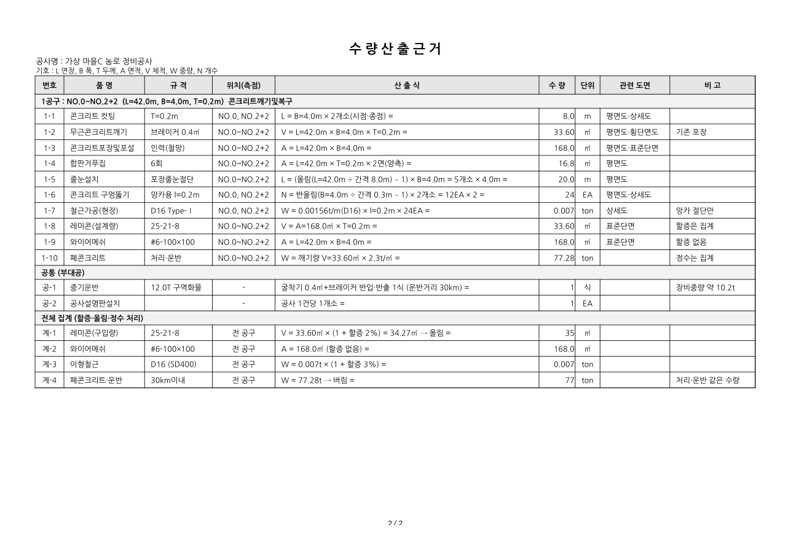

# 소규모 건설공사 설계 자동화 — 쇼룸

**[국토교통]** 읍면동 토목직이 직접 설계하는 소규모 건설공사(총공사비 3천만 원 이하)의
**야장 → 도면 → 수량산출서 → 설계내역** 과정을 자동화하는 도구입니다.
현업 지방공무원(토목직)이 AI 코딩 에이전트를 활용해 직접 개발하고 있으며, 실제 설계 건으로 검증하면서 범위를 넓히고 있습니다.

> 이 저장소는 **쇼룸**입니다. 어떻게 돌아가는지와 결과물의 모습만 보여 드립니다. 소스 코드·자료·테스트는 비공개 저장소에 있습니다.
> 아래 샘플은 모두 **가상 예제**(가상 마을·가상 단가)로 만든 결과물이며, 실제 공사명·지번·금액은 들어 있지 않습니다.

## 왜 만들었나

읍면동 토목 담당자는 매년 수십 건의 소규모 공사를 자체 설계합니다. 현장 야장을 보고 도면을 그리고,
면적·자재·숭상 수량을 손으로 계산해 수량산출서를 만든 뒤 내역 프로그램에 옮겨 적는 과정이 모두 수작업이고,
읍면동마다 양식이 제각각입니다. 이 도구는 **야장만 표준 형식으로 적으면 도면·산출서가 나오도록** 해
반복 계산을 없애고, 같은 양식을 쓰게 하는 것을 목표로 합니다.

## 흐름

입력 한 번으로 도면·수량산출서·산출근거·납품 묶음까지 만듭니다. 계산은 결정론적 코드가 하고, AI는 규칙 정리·검토·문장 작성에만 씁니다.

## 결과물 샘플 (가상 예제)

**아스콘 덧씌우기 전개도** — 본선·접속·확포장·숭상 기호, NOTE·범례 자동 배치

**콘크리트 깨기및복구 평면도** — 줄눈(최대 간격)·컷팅·앙카(접속단부)·거푸집

**수량산출근거** — 품목마다 산출식(기호=값+단위)과 수량, 공구 → 공통 → 전체 집계(할증·올림·정수)

| 가상 예제 | 도면 | 수량산출서 | 화면 |
|---|---|---|---|
| demo01 아스콘 덧씌우기(확포장·숭상·접속) | [PDF](samples/demo01_asphalt/drawing.pdf) | [PDF](samples/demo01_asphalt/sheet.pdf) | [전개도](samples/demo01_asphalt/drawing_strip.png) · [총괄표](samples/demo01_asphalt/sheet_summary.png) · [산출근거](samples/demo01_asphalt/sheet_basis.png) |
| demo02 아스콘 덧씌우기(폭 급변·접속 차선) | [PDF](samples/demo02_asphalt_standard/drawing.pdf) | [PDF](samples/demo02_asphalt_standard/sheet.pdf) | [전개도](samples/demo02_asphalt_standard/drawing_strip.png) · [총괄표](samples/demo02_asphalt_standard/sheet_summary.png) · [산출근거](samples/demo02_asphalt_standard/sheet_basis.png) |
| demo03 콘크리트 깨기및복구 | [PDF](samples/demo03_concrete/drawing.pdf) | [PDF](samples/demo03_concrete/sheet.pdf) | [평면도](samples/demo03_concrete/drawing_plan.png) · [횡단면도](samples/demo03_concrete/drawing_section.png) · [총괄표](samples/demo03_concrete/sheet_summary.png) · [산출근거](samples/demo03_concrete/sheet_basis.png) |

## 시연 영상

시연 영상은 스레드에서: https://www.threads.com/@civil__ax

## 지원 공종

| 공종·기능 | 내용 | 상태 |
|---|---|---|
| 아스콘 덧씌우기 | 본선·접속 면적, 아스콘·유제(할증, 관급 구입량 올림), 노면청소·텍코팅, 차선도색(접속부 규칙) | 실제 3건 검증 |
| 숭상(맨홀·집수정·지수전·그레이팅 인상) | 깨기·재타설 방식, 내역 품목(맨홀인상 규격)별 개소, 폐콘 참고 집계 | 실제 3건 검증 |
| 콘크리트 확포장 | 면적·레미콘·거푸집(편측/양측)·앙카(구멍뚫기·철근) | 실제 2건 검증 |
| 콘크리트 깨기및복구 | 컷팅·깨기·포장·거푸집·줄눈(최대 간격)·앙카(접속단부)·와이어메쉬·폐기물, 평면도·횡단면도 | 실제 1건 검증 |
| 수량산출서 | 수량총괄표 + 수량산출근거, 내역 품목과 1:1, 산출식·수량·엑셀 수식이 같은 식 데이터, 설계변경 당초/변경 두 줄 | 실제 4건 납품 수량과 대조 |
| 단가산출(일위대가) | 품셈 원문 대조값·노임·자재·기계 기초값 → 노무·재료·경비 원 단위, 내역서 금액 | 실제 일위대가 12개 원 단위 일치 |
| 원가계산 | 제비율·절사, 원가계산서 양식 선택, 폐기물처리비 위치, 공사비역산(이윤율·조달수수료 끝수), 수의계약 계약내역 | 실제 4건 원 단위 일치 |
| 도면 | 전개도·평면도·횡단면도, NOTE·범례·라벨 자리 자동, 설계변경 표시, 위치도(항공뷰 도로선 따라 노선) | 실제 4건 납품 도면 대조 |
| 납품 묶음 | 도면 DXF+PDF, 위치도 그림 이름 검사, 산출서, 내역, 갑지 | 실제 납품 구성 기준 |
| 배수 구조물 | 수로관·옹벽식측구·식생블럭·옹벽 단위수량과 산출서 양식 | 1단계 완료 |

## 검증 방식

- **실제 확정 설계와 원 단위 대조**: 비공개 저장소의 테스트 **368개**가 실제 확정 4건의 수량·내역·원가를 내역 프로그램 확정본과 원 단위로, 도면·산출서를 납품본과 글자 단위로 대조합니다.
- **가상 예제 회귀**: 같은 코드를 가상 예제 3건과 가상 단가로 돌리는 테스트 **287개**. 이 쇼룸의 샘플은 그 가상 예제의 결과물입니다.
- **근거 우선순위**: 표준품셈 원문(조항·쪽 번호 대조) → 발주기관 설계기준 → 과거 설계(내역 프로그램 관행). 품셈에 없는 관행값은 '근거 미확인'으로 표시해 둡니다.
- **공개 검사**: 쇼룸에 올리기 전에 금지어(실제 마을명·지번·연락처 등)와 숫자 대조(실제 정답지·실제 단가 숫자), 이용 조건, 결과물 메타데이터를 자동으로 검사합니다.

## 규칙

현장에서 확인한 설계 규칙의 목차는 [docs/규칙_목차.md](docs/규칙_목차.md)에 있습니다(상세 규칙은 비공개).

## 로드맵

| 순서 | 공종 | 상태 |
|---|---|---|
| 1 | 아스콘 덧씌우기 + 숭상 | 실제 3건으로 검증 |
| 2 | 콘크리트 확포장 | 실제 2건으로 검증 |
| 3 | 콘크리트 깨기및복구(농로 재포장) | 실제 1건으로 검증 |
| 4 | 수로관·흄관 매설 | 예정 |
| 5 | 식생블럭·옹벽 | 예정 |

## 참고

- 노임·제비율은 공표값, 샘플의 자재 단가·일위대가는 **가상값**입니다.
- 다른 지자체에서 사용을 원하시면 아래 이용 조건에 따라 신청해 주세요.

## 이용 조건

이 저장소는 오픈소스가 아닙니다. **열람은 공개, 사용은 허락제**입니다(전문은 [LICENSE](LICENSE)).

- 코드·문서·자료는 열람과 학습 목적의 읽기만 허용합니다. 설치·실행·복제·수정·배포·상업적 이용은 공공기관을 포함한 모든 이용자가 저작권자의 사전 서면 허락을 받아야 합니다.
- 공공기관(국가·지방자치단체·공공기관)의 비영리 업무 이용은 신청 시 무상으로 허락합니다.
- 업체의 판매·납품·용역 등 상업적 이용은 별도 협의가 필요합니다.

이용 신청·문의: https://open.kakao.com/me/tomokax — 신청하실 때 **기관명·담당 부서·이용 목적**을 알려 주세요.
